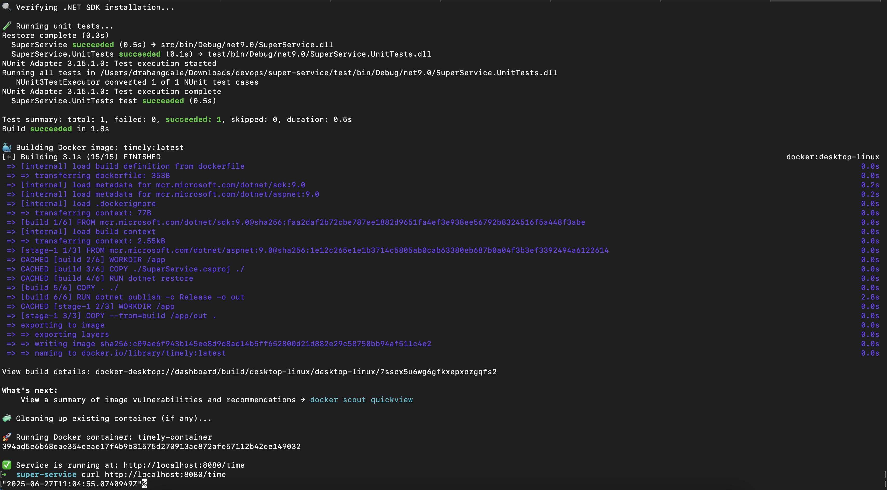

# 🕒 Timely – .NET 9 Web API (DevOps Deployment Task)

This project is a simple .NET 9 Web API that returns the current UTC time in ISO 8601 format. It is containerized using Docker, includes automated unit testing, and can be deployed locally or in the cloud. A PowerShell script automates the entire setup. CI/CD is also set up via GitHub Actions as a bonus.

---

## ✅ Requirements

- [.NET 9 SDK](https://dotnet.microsoft.com/en-us/download/dotnet/9.0)
- Docker
- PowerShell Core (`pwsh`)
- macOS/Linux/Windows (Apple Silicon supported via multi-arch Docker image)

---

## 📝 .NET Version Upgrade

This application was originally scaffolded using `.NET Core 3.1`.  
As part of modernization and long-term support readiness, we updated the target framework in both:

- `src/SuperService.csproj`
- `test/SuperService.UnitTests.csproj`

To:

```xml
<TargetFramework>net9.0</TargetFramework>
```

Also, Docker and GitHub Actions were updated to use `mcr.microsoft.com/dotnet/sdk:9.0`.

---

## 📁 Project Structure

```
super-service/
├── src/                    # Main API project (SuperService)
├── test/                   # Unit tests using NUnit
├── Deploy.ps1              # PowerShell automation script
├── .github/workflows/      # GitHub Actions CI/CD
└── readme.md               # You're reading this
```

---

## 🚀 Running the App Locally (PowerShell)

Run the entire workflow locally with:

```bash
pwsh ./Deploy.ps1
```

This will:

1. Run unit tests  
2. Build the Docker image  
3. Stop and remove any old container  
4. Start a new container locally

---

## 🌐 Test the API

Visit in your browser or terminal:

```bash
curl http://localhost:8080/time
```

You’ll get a UTC timestamp like:

```
"2025-06-27T11:04:55.0740949Z"
```

---
## 📸 Sample Output

Here’s what the running app looks like when deployed via PowerShell:


## 🐳 Docker

### Build image manually:

```bash
docker build -t timely:latest ./src
```

### Run container manually:

```bash
docker run -d -p 8081:8443 -v $(pwd)/src/https:/app/https --name timely-container timely:latest
```

---

## 🔍 Program.cs Modification

In `Program.cs`,  Kestrel is explicitly bound to HTTPS using:

```csharp
webBuilder.UseUrls("https://0.0.0.0:8443");
```

This ensures the app listens on port 8443 inside the container, matching the Docker -p mapping.

The aspnetapp.pfx certificate is mounted into the container and referenced from /app/https.

---

## 🧪 Unit Tests

Tests are defined using NUnit in the `/test` folder.

Initially, the test was failing due to a hardcoded placeholder:

```csharp
Assert.That(true, Is.EqualTo(false), "oops!");
```
As permitted in the project description (“Make any changes to the application you think are useful for a deploy process”), I removed this placeholder and implemented a valid test that verifies the /time endpoint returns the expected format.

To run manually:

```bash
dotnet test ./test/SuperService.UnitTests.csproj
```

---

## 🔄 GitHub Actions CI/CD (Bonus)

A workflow in `.github/workflows/docker-build.yml`:

- Runs on every push to `main`
- Installs .NET SDK 9
- Runs tests
- Builds and pushes Docker image to Docker Hub

### Required Secrets:

Set these in your repo’s **Settings > Secrets > Actions**:

| Key              | Value                        |
|------------------|------------------------------|
| `DOCKER_USERNAME`| Your Docker Hub username     |
| `DOCKER_PASSWORD`| Your Docker Hub token/password |

---

## 📦 Docker Hub Image

The final image can be pulled using:

```bash
docker pull dushyantrahangdale5/timely:latest
```

---

## 👨‍💻 Author

**Dushyant Rahangdale**

Designed for DevOps deployment evaluation.
